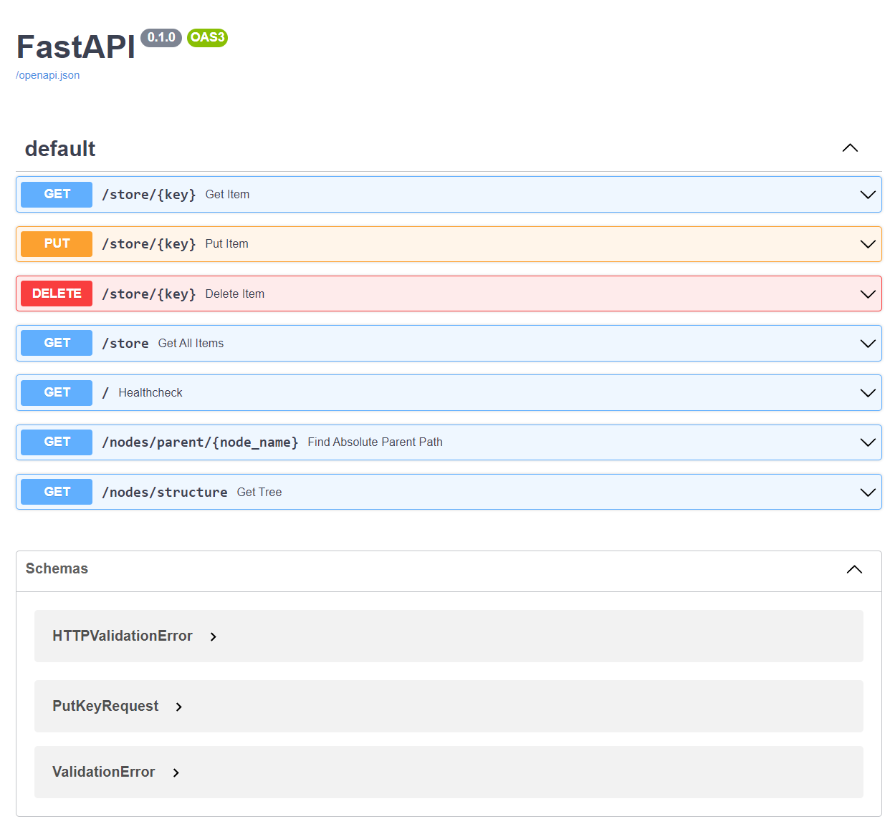

# Binary Tree distributed cache

This application is a simple implementation of distributed cache in a form of binary tree (i.e. each node has up to two children).
The app is built on Vagrant and Docker. The system contains a single Zookeeper node and N cache nodes that are simple key value
stores. Each cache node is a separate Docker container that uses FastAPI to implement a REST API service and Kazoo to register in Zookeeper.

Each node exposes said API on port 5000 (inside Docker network) which other nodes communicate through. The API has several
endpoints:

- `/store` endpoint is used to perform operations on the store itself - GET, PUT, and DELETE

- `/nodes` endpoint is used to get information about the nodes in the system (this is only accessible in the root node)

- `/docs` endpoint is used to get OpenAPI documentation

- `/` endpoint is used to get information about the node itself and serves as a simple health check

# The infrastructure

As previously mentioned, the nodes form a binary tree. This
tree is kept both in Zookeeper and the root node. The application does not expect any nodes to fail. Apart from
the root node, the tree is formed arbitrarily - first node
that contacts the root node is assigned as the left child,
second as the right child, etc. The root node is the only node
that is consistent in the system. After registering in the root node, each node also registers itself in the Zookeeper.

## Configuration

The application can be configured using `Vagrantfile`. We can configure following properties (starting at line 33):

- `TREE_DEPTH` - the depth of the tree. The root node is at depth 1, its children are at depth 2, etc. The default value is 3.

- `ROOT_NODE_ID` - specifies id of the root node. The identifiers are indexed from 1 to N, where N is the number of nodes in the system. The default value is 1.

- `STARTUP_DELAY` - specifies the delay between starting the nodes. The default value is 1 second. Root node should always start first.

# Running the application

To run the application, we need to have Vagrant and Docker installed. Then in the root of the project, we run:
`vagrant destroy -f && vagrant up` or `vagrant up` if it is the first time we run the application.

## Communication with the nodes via HTTP

Each node exposes its API port on the host machine depending on
its id. By default, the first node (NODE-1) starts on port 5001 (NODE-2 would be on port 5002, etc.) - i.e. it can be accessed like so:

`curl http://localhost:5001/`

Which will give us the following json:
```
{
    "status": "alive",
    "node": "NODE-1",
    "address": "10.0.1.67"
}
```

Alternatively, we can also use ssh to connect to the Docker container and
communicate with the API via docker's network. To do so we need
to use the 10.0.1.* address space or preferably the container's name. For example, to get the same response as above, we run:

```
vagrant ssh NODE-1
curl http://NODE-1:5000/
```

Internally, all APIs run on port 5000.

### OpenAPI Documentation

The API is documented using OpenAPI which is exposed on the
`/docs` endpoint. For example, the documentation for the first node can be accessed here http://localhost:5001/docs.

The root node always contains additional endpoints to check the structure of the tree and the nodes in the system. The OpenAPI page should look like this:




## CLI application

Additionally, the project contains a CLI application that can be 
used to communicate with the nodes. This application can be run
in docker container or on the host machine (though it is necessary to install its dependencies via `pip install -r requirements.txt`).


### Usage

To run the CLI application, we need to have Python 3.9+ setup and two dependencies: `fire` and `httpx` which can
be installed via `requirements.txt` file in the `cli` directory, or are installed automatically in the Docker container.

To perform a request, we run:

```bash
python cli.py [GET|PUT|DELETE] [NODE_ID] [KEY_OR_KEY_VALUE]
```

Where `[GET|PUT|DELETE]` is a HTTP method, `NODE_ID` is the id of the node we want to communicate with (this can be either in format `NODE-{ID}` or just `{ID}` - e.g. both `NODE-7` and `7` are valid), and `KEY_OR_KEY_VALUE` is either a key or a key-value pair in format `KEY VALUE`.

For example, to get the value of key `key1` from node `NODE-1`, we run:

```bash
python cli.py get NODE-1 key1
```

To put a key-value pair `key1 value1` in node `NODE-1`, we run:

```bash
python cli.py put NODE-1 key1 value1
```

And finally, to delete the key `key1` from node `NODE-1`, we run:

```bash
python cli.py delete NODE-1 key1
```

The application always prints returned JSON response and the status
code of the request. E.g.

```bash
python cli.py put 4 hello world
200 {'key': 'hello', 'value': 'world'}

python cli.py delete 4 hello
200 {'key': 'hello'}
```

### Dockerized variant

The Dockerized variant is run the exact same way, except that we need to use `python3.9` instead of `python`. Easiest way is to ssh to the vagrant machine and run the command from there:

```bash
vagrant ssh cli
```

Both the CLI script and runtime are located in the opt folder:

```bash
cd /opt
```
Then we can run the CLI application as described above. e.g.

```bash
python3.9 cli.py put 6 hello world
```

# Cache coherence

Currently, the system is not cache coherent because the changes introduced to any node are
only propagated upwards. 
For example, if we have root node `NODE-1` and put a key-value pair `hello-world` to `NODE-6` and `hello-mars` to `NODE-7`. `NODE-1` and `NODE-7` will return `mars` but `NODE-6` will return `world` since no one updated it.

For this application we might want to make the cache eventually consistent - i.e. the system is going to be AP (available and partition tolerant). 

If we do not require strict consistency, the cache can (at some point) contain old values, and we can simply propagate new
changes from the root node to all nodes periodically (e.g. every 5s or so). This could be a new endpoint of the node (something like `/synchronize`), that is only accessible to the root node to push all changes at once. The root node would
then periodically POST this endpoint on all nodes. 

The main disvantage of this approach is that it is not very scalable - the more nodes we have, the more requests we need to make and the requests will contain large amounts of data.

